# はじめての建築3Dエディタ（初心者向け）

間取りを描いて、「地震や風に耐える壁が足りているか」を確かめ、確認申請の下書き用の計算書まで出す道具です。建築の知識がなくても、10分で一通り体験できます。

- 開く場所：https://you0810jmsdf.github.io/pascal-editor/ （インストール不要・ログイン不要）
- 基準日：2025年4月1日施行の建築基準法・告示

> **先に大事なこと**
> この道具の計算結果は「設計を検討するための参考値」です。そのままでは**確認申請に出せません**。申請には、建築士が入力条件と結果を確かめ、正式な図書として作り直す必要があります。法令は改正されるので、結果は基準日（2025-04-01）の時点のものです。

---

## 1. これは何ができる道具か

| できること | できないこと |
|---|---|
| 木造2階建て以下の家の間取りを2D・3Dで描く | 3階建て・鉄骨・鉄筋コンクリートの計算 |
| 耐力壁（地震や風に耐える壁）の量を計算して「足りる／足りない」を出す | 確認申請書そのものの作成 |
| 法規の確認項目を並べ、判定できるものは判定する | 敷地の用途地域などを自動で調べること（人が入力する） |
| 計算書（D1〜D9）を画面で見る・印刷する・PDFにする | 日影図・天空率 |

**言葉の言い換え**（このあとの章で出てきます）

| 言葉 | 一言で |
|---|---|
| 耐力壁 | 地震や風の横揺れに耐える壁 |
| 壁倍率 | 壁の強さの点数（合板の壁は 2.5、4.5×9cm の筋かいは 2.0） |
| 必要壁量 | 家の大きさと重さから決まる、最低限必要な耐力壁の長さ |
| 存在壁量 | 描いた家にある耐力壁の実際の量（長さ × 倍率） |
| 充足率 | 存在壁量 ÷ 必要壁量。100%以上で合格 |
| 四分割法 | 壁が家の片側に偏っていないかの確認 |

---

## 2. 画面の見方

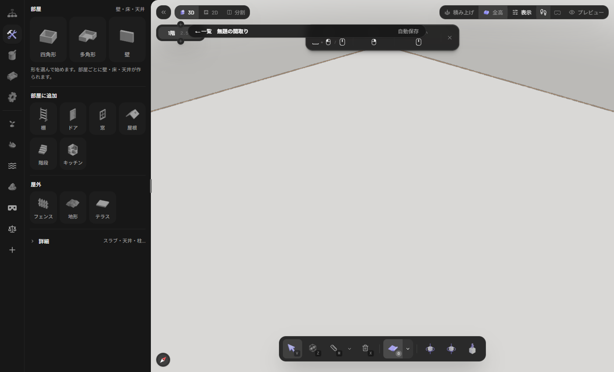

| 場所 | 役割 |
|---|---|
| 左端の縦のアイコン列 | 機能の切り替え。ハンマーのアイコン＝「建築」（部屋・壁・ドアなどを作る）、天秤のアイコン＝「建築法規」（強度の計算） |
| その右の広い欄 | 選んだ機能の中身（部屋の形、壁、ドア、窓、屋根など） |
| 画面上の「3D／2D／分割」 | 立体で見る／平面図で見る／左右に並べる |
| 左上の「1階」のバッジ | 今いる階。上下の「＋」で階を足す。数字（2.5 m）は**階の高さ**（計算に使われる） |
| 下の道具列 | 選択（V）・ゾーン（Z）・計測（M）・削除（X）。右端の3つはカメラの向き |
| 右下の小さな枠 | いま選んでいる道具のショートカット（ヒント） |
| 左下のコンパス | 押すと平面図が「上が北」にそろう |

「分割」にすると、左に平面図・右に立体が並びます（描きながら両方を見られます）。

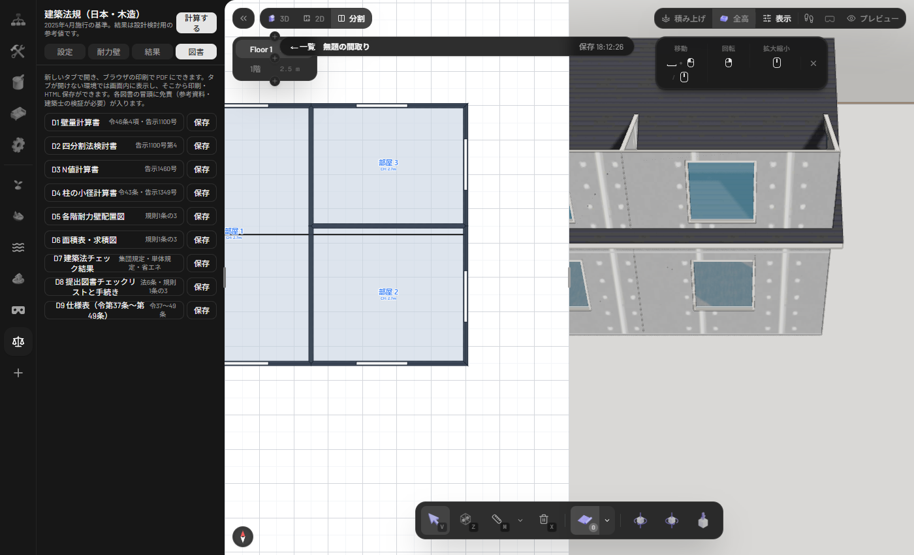

> 画面の一部は英語のままです（階の名前「Floor 1」、屋根の形「Hip／Gable」、道具の「Zone」など）。機能には影響しません。

---

## 3. 間取りを描く

この章は、**横9.0m × 縦7.5m の2階建て**（床面積 67.5㎡ × 2）を例に描きます。グリッド（方眼）は 0.5m 刻みで吸い付くので、この寸法がちょうどです。

### 3-1 部屋を描く（四角形）

1. 画面上の「2D」を押し、左下のコンパスで北向きにそろえる（方眼が斜めに見えるときはこれ）。
2. 左の「四角形」を押す。
3. 角を1か所クリック → 対角の角をクリック。ドラッグ中に辺の長さ（9m と 7.5m）が出ます。

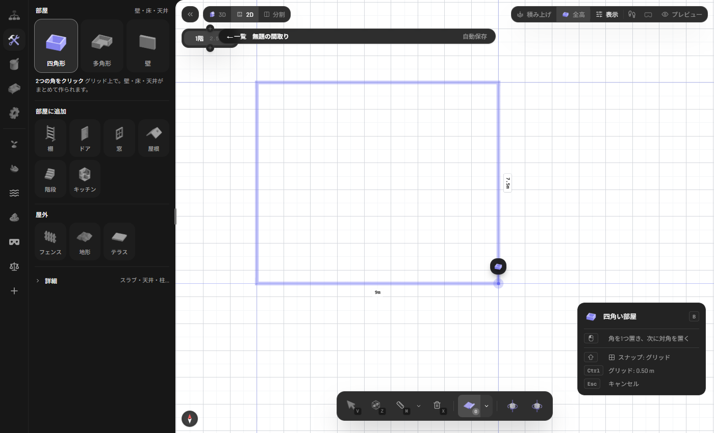

壁・床・天井が部屋ごとにまとめて作られます。L字や斜めの部屋は「多角形」（角を順にクリックし、最後に最初の角をクリックして閉じる）を使います。

### 3-2 間仕切り壁を足す

「壁」を押し、始点 → 終点の順にクリック（`Esc` で終了）。部屋の壁の途中をクリックすれば間仕切りになり、交わる所で壁が自動で分かれます。この例では縦の壁（左から4.5m）と、右側を上下に分ける横の壁（縦3.5mの位置）を引きました。

### 3-3 ドアと窓

「ドア」または「窓」を押し、壁の上にカーソルを置いてクリック。ドアは約0.9m幅で、開く向きが点線で見えます（`R` で左右反転）。窓は約1.5m幅です。続けて置けないことがあったので、**1つ置くごとに道具を選び直す**と確実です。

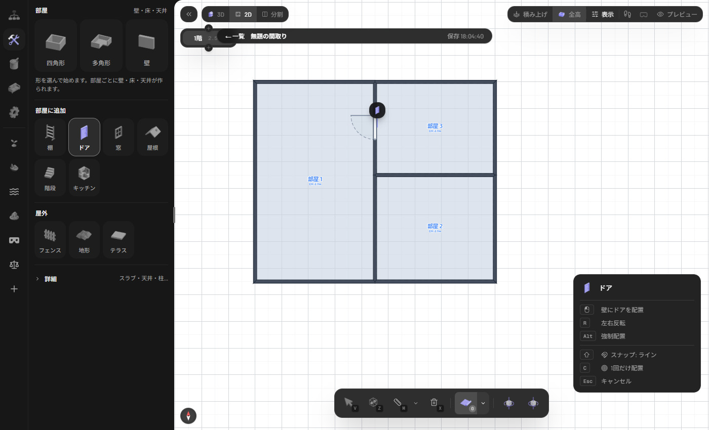

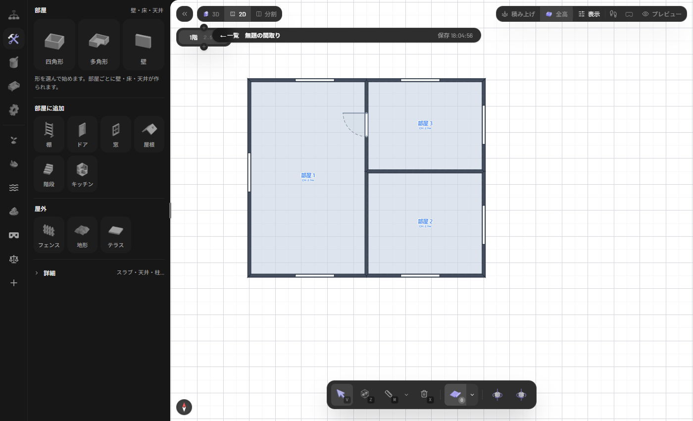

### 3-4 2階を足す

左上の「1階」バッジの上の「＋」で、上に階が足されます（この画面では「Floor 1」と表示されますが2階です）。**2階は空で始まる**ので、1階と同じ手順でもう一度、同じ位置に部屋・間仕切り・窓を描きます（同じ位置に描くと、床面積も同じになります）。

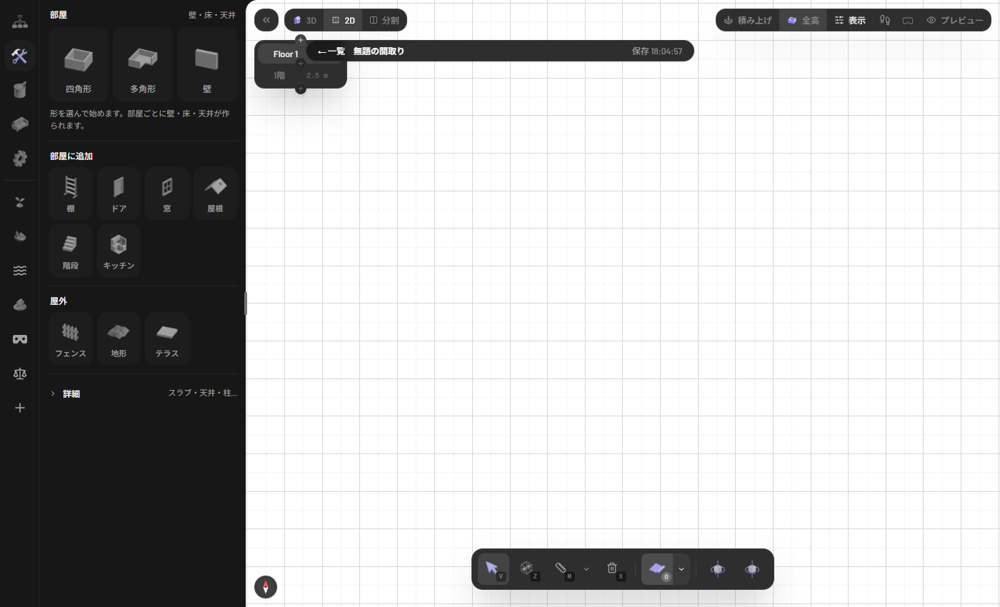

### 3-5 屋根を載せる

2階を選んだまま「屋根」を押し、左下に出る「屋根の形」で形（Gable＝切妻など）を選び、「Create from」を **Draw** にして、建物の対角2点をクリックします。「部屋」にすると**部屋ごと**に屋根ができるので、間仕切りのある家には向きません。

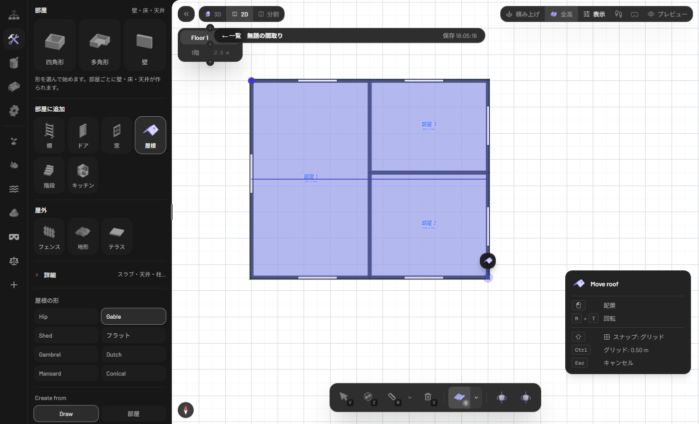

### 3-6 立体で確かめる

「3D」に切り替えます。マウスホイールで拡大・縮小できます。操作の絵は画面上部のヒント枠に出ます。

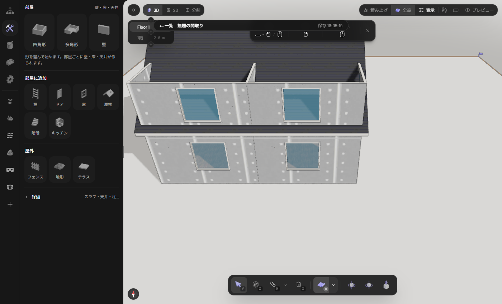

### ショートカット早見表

| キー | 働き |
|---|---|
| `V` | 選択 |
| `B` | 部屋（四角形／多角形）を描く |
| `M` | 距離を測る |
| `X` | 削除 |
| `Esc` | 描いている途中のものをやめる |
| `Shift`・`Ctrl` | スナップ（吸い付き）とグリッド刻みの操作。右下のヒント枠に「スナップ: グリッド」「グリッド: 0.50 m」と現在の状態が出る（刻みは下の道具列の「グリッド間隔」ボタンでも切り替わる） |
| `R` | ドアの左右反転 |
| `C` | ドア・窓を1回だけ置く |
| `Alt` | ドアを強制配置 |

---

## 4. 保存と読み込み

- 描いている間は**自動で保存**されます（上のバーに「保存 18:06:03」のように出る）。
- 左上の「← 一覧」を押すと「保存した間取り」の一覧に戻れます。「開く／名前を変更／複製／削除」ができます。
- **保存先はこのブラウザの中だけ**です（サーバーには送られません）。ブラウザのデータを消すと間取りも消えます。大事な間取りは「複製」してから作業すると安心です。

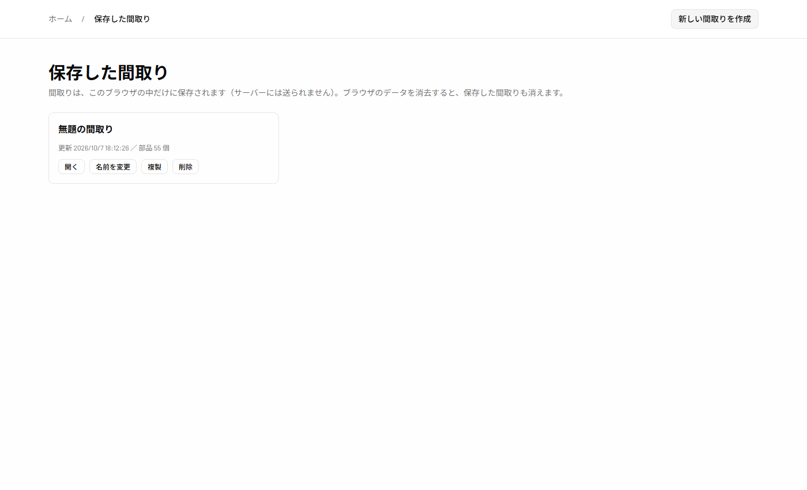

---

## 5. 強度の目安を見る（壁量計算）

左端の**天秤のアイコン**＝「建築法規」を開きます。上に「設定／耐力壁／結果／図書」の4つのタブがあります。

### 5-1 設定（入力は最小限でよい）

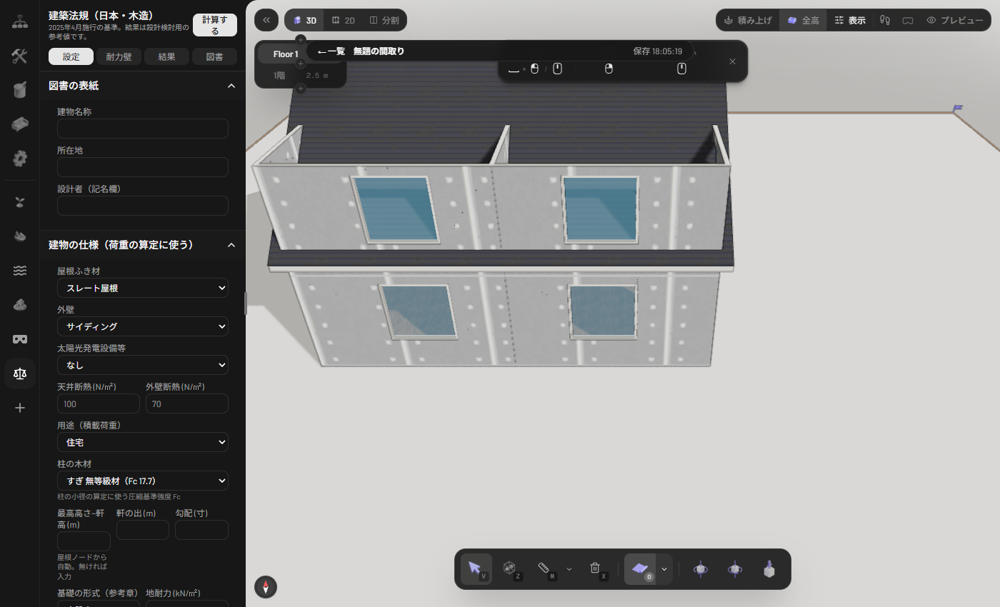

屋根のふき材（スレート・瓦・金属板）、外壁（サイディングなど）、太陽光、断熱、用途、柱の木材を選びます。**入力しなくても計算は動きます**。未入力のときは「スレート屋根・サイディング」などの標準の値で計算し、そのことが結果の注記に出ます。この例ではスレート屋根・サイディングを選びました。

### 5-2 耐力壁（どの壁を何にするか）

**ここが一番大事な操作です。** 描いた壁は、最初は「非耐力壁（集計しない）」なので、存在壁量が0になります。

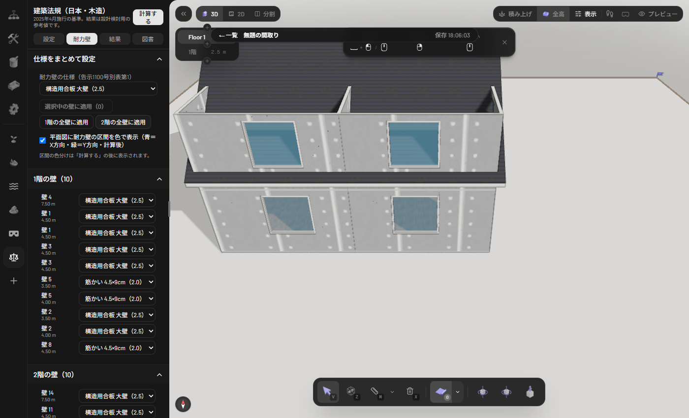

1. 「耐力壁の仕様」で「構造用合板 大壁（2.5）」を選ぶ。
2. 「1階の全壁に適用」「2階の全壁に適用」を押す。
3. 間仕切りの壁だけ、壁ごとの欄で「筋かい 4.5×9cm（2.0）」に変える（壁の長さで見分けます。この例は 3.5m・4.0m・4.5m の3本ずつ）。

画面の壁をクリックして選び、「選択中の壁に適用」で変える方法もあります（今回の検証では試していません）。

### 5-3 計算する

右上の「計算する」を押し、「結果」タブを見ます。**間取りや壁の仕様を変えたら、もう一度「計算する」を押します。**

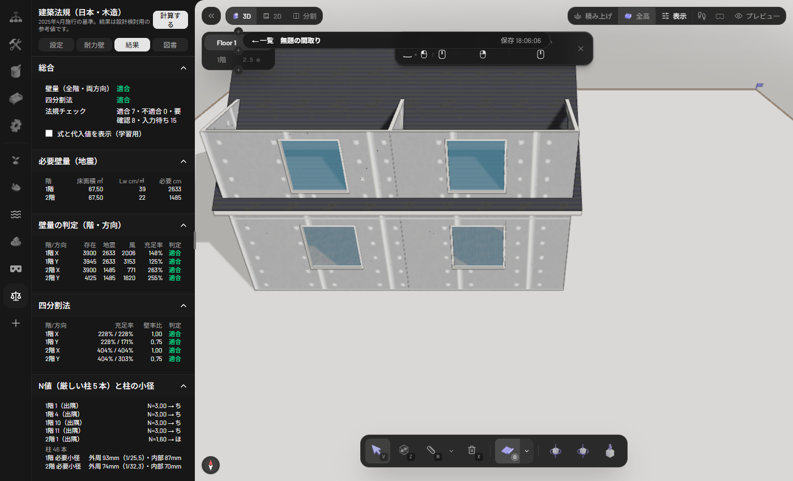

### 5-4 結果の読み方

| 見る所 | この例の値 | 読み方 |
|---|---|---|
| 総合：壁量 | 適合 | 全階・両方向で合格 |
| 総合：四分割法 | 適合 | 壁の偏りも問題なし |
| 必要壁量（地震） | 1階 2633cm／2階 1485cm | 床面積 67.5㎡ × (39 または 22 cm/㎡) |
| 壁量の判定 | 1階X 148%、1階Y 125%、2階X 263%、2階Y 255% | **100%以上で適合**。X・Yは家の2方向 |

**何%あれば安心か**：法律上の合格ラインは 100%（これを下回ると不適合）です。100%ちょうどは余裕がないので、設計では2〜3割ほど余裕を見ることが多い、というのが一般的な感覚です（確信度：中。法律の決まりではありません）。

「式と代入値を表示（学習用）」にチェックを入れると、各数字の計算式と代入した値が見られます。

**不適合の例**：全部の壁を「非耐力壁」にして計算すると、存在壁量が0になって赤い「不適合」が並びます。壁が足りないときは、壁を増やす・倍率の高い仕様に変える、で直します。

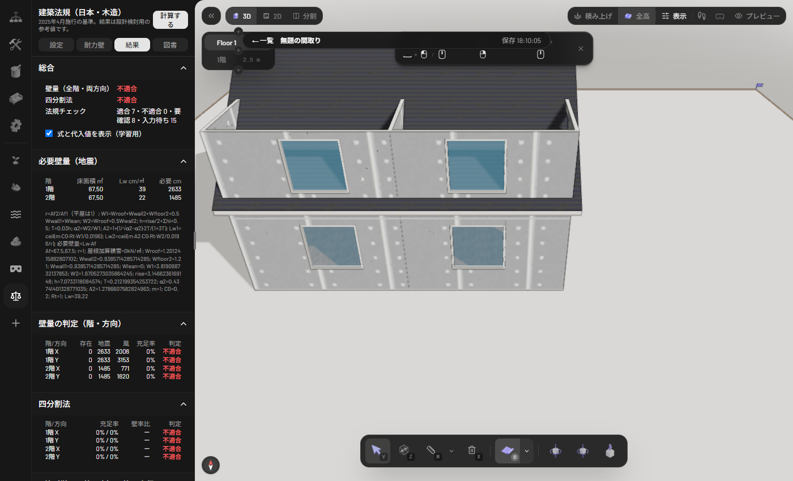

---

## 6. 法規チェックの読み方

「結果」タブの下の方に、建築基準法のチェック項目が並びます（接道・建蔽率・容積率・斜線・採光・換気・天井高・階段・省エネ・手続きなど）。

| 表示 | 意味 |
|---|---|
| 適合 | 基準を満たした |
| 不適合 | 基準を満たさない（赤） |
| 要確認 | 判定はしたが、人が見て確かめる必要がある |
| 入力待ち | **まだ判定していない**（判定に必要な情報が未入力） |
| 対象外 | この建物には当てはまらない |

「入力待ち」の多くは、「設定」タブの「敷地の法規」（用途地域・建蔽率・容積率・道路など）を入力すると判定されます。部屋の種別（居室かどうか）も同じタブにあります。**この道具は敷地の情報を自動では調べません。**

---

## 7. 図書（計算書）を出す

「図書」タブに D1〜D9 のボタンが並びます。

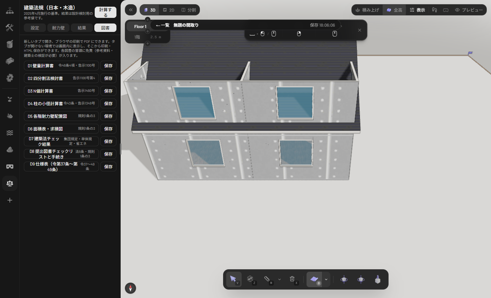

| 図書 | 中身 |
|---|---|
| D1 壁量計算書 | 必要壁量・存在壁量・判定（一番よく使う） |
| D2 四分割法検討書 | 壁の偏りの確認 |
| D3 N値計算書 | 柱の引き抜きと金物 |
| D4 柱の小径計算書 | 柱の太さ |
| D5 各階耐力壁配置図 | 耐力壁の位置の図 |
| D6 面積表・求積図 | 床面積 |
| D7 建築法チェック結果 | 法規チェックの一覧 |
| D8 提出図書チェックリストと手続き | 申請に必要な書類の一覧 |
| D9 仕様表 | 基礎・土台などの記入欄 |

押すと**新しいタブ**で計算書が開きます。上の「印刷／PDF保存」からブラウザの印刷でPDFにできます。「保存」ボタンはHTMLファイルとして保存します。タブが開けない環境では画面の中に表示され、そこから印刷・保存できます。各図書の先頭には「参考資料・建築士の検証が必要」という注意が入ります。

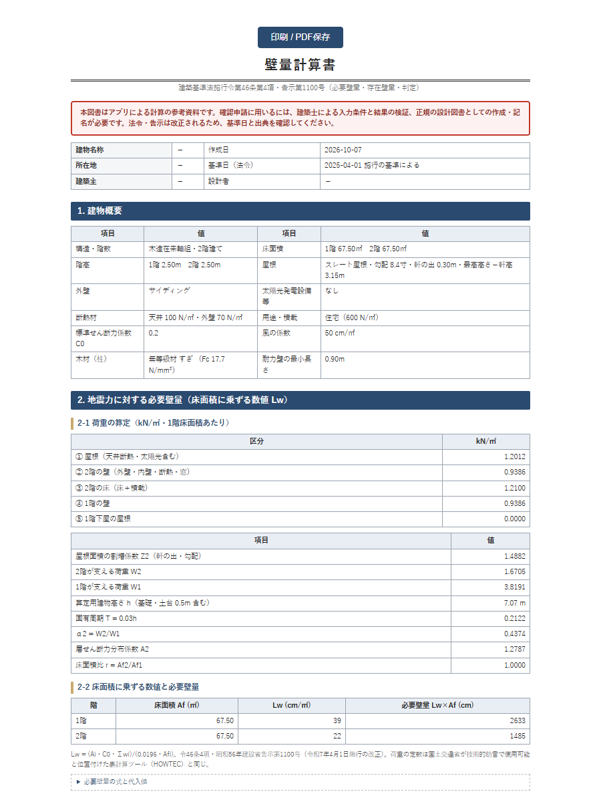

---

## 8. 困ったとき

| 状況 | 対処 |
|---|---|
| 結果が全部「不適合」・存在壁量0 | 壁の仕様が「非耐力壁」のまま。5-2 の手順で仕様を付ける |
| 「モデルが変わりました。「計算する」で結果を更新してください。」と橙色で出る | 計算したあとに間取りや仕様を変えた。もう一度「計算する」 |

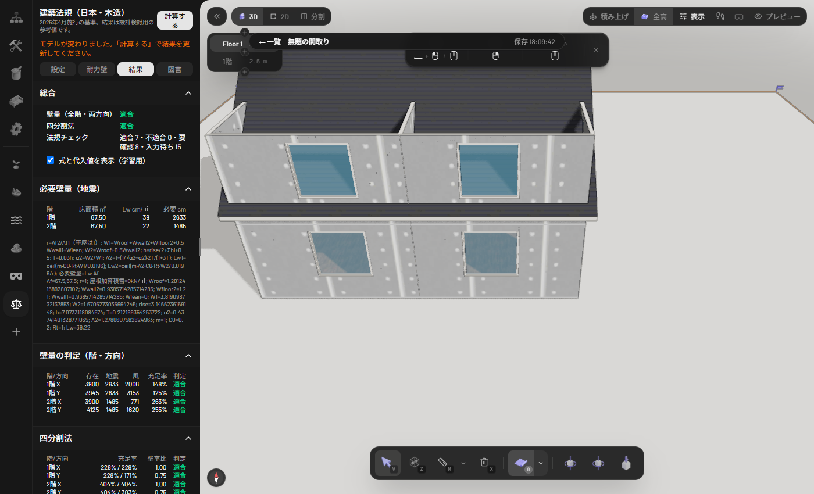

| 状況 | 対処 |
|---|---|
| 屋根を描いていない | 計算は止まらず、「4寸勾配の切妻・軒の出0.45m・短辺方向に棟」を仮定して注記が出る（実装の記録による。画面では試していません）。屋根を描けば実際の形で計算される |
| 斜めの壁・曲がった壁 | 耐力壁として**数えません**（水平から22.5°を超える斜め壁と曲面壁は集計外） |
| 窓やドアの幅だけ壁が足りない | 開口の幅は壁量から引かれる。0.9m未満の残りの壁は耐力壁として数えない |
| 階の高さを変えたい | 階の高さは左上の階バッジに表示されます（既定 2.5 m。D1 の階高もこの値）。変更方法は今回確認できていません |
| 平面図で耐力壁の色（青・緑）が見えない | 現在は壁の下に隠れて見えません（既知の不具合）。結果の表と図書 D5 で位置を確認してください |
| 図書の「壁番号」が英数字の羅列 | 内部の番号です。長さと仕様で見分けてください |
| 間取りが消えた | ブラウザのデータを消すと消えます。復元できません |

---

## 免責（再掲）

この道具の結果は設計検討用の参考値です。確認申請には、建築士による入力条件と結果の検証、正規の設計図書としての作成・記名が必要です。法令・告示は改正されます（基準日 2025-04-01）。
