# 建築士のための建築3Dエディタ ― 構造と法規（実務者向け）

対象：構造・法規の実務者。この道具が「**何を・どの式と条文で・どんな近似で**」計算しているか、確認申請に使う前に**自分で何を検証すべきか**を書く。操作の手順（部屋・壁・開口の描き方）は初心者向けの [A_はじめての建築3Dエディタ.md](A_はじめての建築3Dエディタ.md) に任せ、ここでは計算と判定に絞る。

- 基準日：令和7年（2025）4月1日施行の建築基準法・同施行令・告示
- アプリ：https://you0810jmsdf.github.io/pascal-editor/ （上流 pascalorg/editor のフォーク、ブランチ nsfactory）
- 仕様書：`docs/nsfactory/kenchiku-spec.md`、実装状況：`docs/nsfactory/kenchiku-status.md`、設計：`wiki/architecture/kenchiku.md`
- 計算エンジン：`packages/kenchiku/src/`（Pascal 非依存。`structural/` 式、`code-check/` 法規、`documents/` 図書、`knowledge/` 定数と条文）
- この文書の数値は、2026-10-07 に公開版と同じビルドで 9.0m × 7.5m の2階建てを実際に操作して得た画面・図書の値、またはエンジンのテスト値（`bun test` 73件通過）である。

> **免責**：結果は設計検討用の参考値。確認申請には、建築士による入力条件と結果の検証、正規の設計図書としての作成・記名が必要。法令・告示は改正される。

---

## 1. 位置づけ

| 項目 | 内容 |
|---|---|
| 対象 | 木造軸組工法、階数2以下、延べ300㎡以下、高さ16m以下の戸建て住宅（令和7年4月改正後の新2号建築物と新3号） |
| 構造の確認方法 | **仕様規定ルート**：壁量（令46条4項・告示1100号）、四分割法、N値（告示1460号）、柱の小径（令43条・告示1349号） |
| できること | 上記の計算と過程の開示、法規チェック19項目、図書 D1〜D9 の HTML 生成、MCP ツール4種 |
| できないこと | 許容応力度計算（令82条）、3階建て・300㎡超（`RangeError`→「計算できない」で止まる）、鉄骨・RC、基礎・横架材の本計算、省エネ計算、日影図・天空率 |

新3号（平屋200㎡以下）は構造審査が省略されるが、令46条4項は階数2以上または50㎡超で適用されるため平屋も計算する。

**全結果に explain が付く**：すべての数値は `{ value, explain: { formula, substituted, references, notes, steps } }` で返る。画面の「式と代入値を表示（学習用）」と、図書の折りたたみがこれを開く。検証の入口はここである。

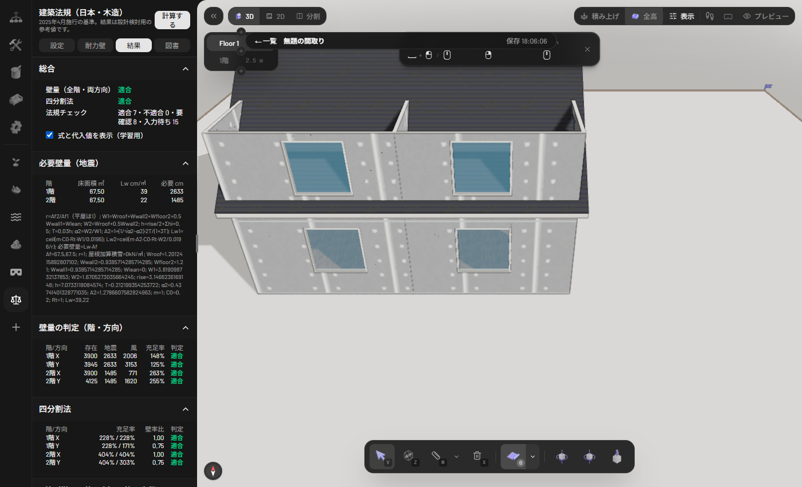

---

## 2. モデルの前提

**座標と回転**：建物ローカル座標（m）。壁の主方向（長さ重み・90°周期）を求めて X 軸に合わせて回す（`axisRotation`）。斜めに描いた建物でも X/Y を集計できる。敷地と真北も同じ座標へ移す。

**床面積（壁芯）**：壁を `wall-frame` で中心線に正規化し、`room-graph` の部屋ポリゴンを union して外周を得る。座標法で面積を出し、吹抜けは控除する。許容誤差 ±1%（D6 に注記）。令2条1項3号の壁芯である。

| 前提 | 値・扱い |
|---|---|
| 階高 | 「階の高さ」（既定 2.5m）。**部屋の天井高（既定 2.7m）とは別**で、荷重・柱の小径・見付面積は階高を使う。階高を壁の実高と合わせて入力する責任は利用者にある |
| 横架材上端間距離 Ho | 階高 − 梁せい（2階建ての1階 0.12m、それ以外 0.105m）で近似。梁せいの実寸が分かるなら `horizontalMemberDistance` を入れる |
| 開口 | 開口中心 u と幅 w から区間 `[u−w/2, u+w/2]` を壁から引く。ドア 0.9m、窓 1.5m（本実験の既定） |
| 屋根の諸元 | `rise`（最高高さ−軒高）・`overhang`・`pitchSun`（寸）を屋根ノードから取る。この例は 8.4寸・軒の出 0.30m・rise 3.15m |
| 屋根が無い | 止めずに、4寸切妻・軒の出 0.45m・短辺に棟、を仮定して注記（実装記録による。公開版で屋根なしの経路は今回検証していない） |
| 仕様が未入力 | 外壁＝サイディング、屋根＝スレート、木材＝すぎ無等級、積載＝住宅で計算し、注記に明示 |
| 範囲外 | 3階建て・300㎡超は計算を拒否（`RangeError`） |

---

## 3. 入力項目の意味と出典

画面の「設定」タブ・「耐力壁」タブの項目と、背後の値。

**建物の仕様（荷重）** ― 数値は HOWTEC 表計算ツール（2025-12 版）と同一（仕様書 §4.1）。

| 項目 | 値 | 備考 |
|---|---|---|
| 屋根 G1（N/㎡・屋根面積当たり） | 瓦 990／スレート 740／金属板 500 | 屋根面積割増 Z2 を乗ずる |
| 太陽光 D2 | なし 0／標準 200／任意 | Z2 を乗ずる |
| 天井断熱 D1（床面積当たり） | 100 | 入力可 |
| 外壁 G2（壁面積当たり） | 土塗り 1000／モルタル 890／サイディング 600／金属 500／下見板 350 | |
| 外壁断熱 D3 | 70 | 入力可 |
| 高断熱窓 D4 | 400（壁面積の 9% を開口とみなす） | 常に算入 |
| 内壁 G3 | 200 × h/2.8 | せっこうボード |
| 床 G4 / 積載 P1 | 610／住宅 600・事務所 800（地震用）。柱用は 1300・1800 | 令85条 |
| 基準建物 | 6.0m × 16.5m（外周 45m） | 壁荷重の床面積換算の仮定 |
| C0・Rt | 0.2（令88条2項区域 0.3）・1.0 | **C0 の区域は入力項目** |
| 柱の Fc | 既定 すぎ無等級 17.7 N/mm²（169件の表から選択） | `knowledge/timber-fc.ts` |
| 風係数 | 50（既定）〜75 cm/㎡ | **区域指定は入力項目**。印西市の指定は要確認 |

**敷地**（人が入力。自動取得しない）：用途地域、建蔽率・容積率、角地緩和、防火の指定、絶対高さ、外壁後退、接道（敷地境界の辺番号・幅員・種別）、真北、省エネ地域区分、提出先メモ。**部屋**：居室区分（未設定は居室扱い＝安全側）、採光補正係数用の隣地距離 d。

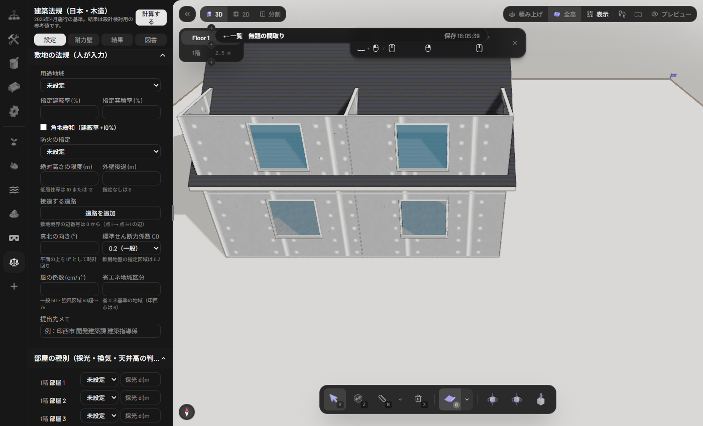

**耐力壁の仕様**：昭和56年建設省告示第1100号別表第1の区分と倍率を選ぶ（構造用合板 2.5、せっこうボード 0.9、筋かい 1.0/1.5/2.0/3.0、たすき掛け 2.0/3.0/4.0/5.0、木ずり片面 0.5・両面 1.0、その他の面材・大臣認定は倍率入力）。併用は和で上限 7（9cm 角のたすき掛けを含むとき 5）。筋かいの αh は Ho > 3.2m のとき `min(1, 3.5·Ld/Ho)`（国住指第425号）。

> **注意**：壁インスペクタへの欄追加は未実装。耐力壁の仕様は建築法規パネルの「耐力壁」タブで、階一括または壁ごとに設定する。**準耐力壁等（面材・木ずり・垂れ壁・腰壁）はエンジンが対応するが、画面から壁ごとに指定する入力欄は無い**（「準耐力壁等を算入」の切替のみ）。

---

## 4. 必要壁量（地震）

**式**（令46条4項・告示1100号、令和7年改正）：`Lw = (Ai·C0·Σwi)/(0.0196·Afi)`。階の荷重の実況に基づく一本化された式で、旧表（11/29/15 など）は使わない。実装は公式表計算ツールの算定式・丸めを移植している。

```
Z2 = (16.5+2ov)(6+2ov)√(p²+10²) / (16.5·6) / 10
Wwall(h) = ( ceil10(G2·45h·0.91/99) + 200h/2.8 + ceil10(D3·45h·0.91/99) + ceil10(400·45h·0.09/99) ) / 1000
2階建て（1階床面積 1 ㎡当たり kN）:
  Wroof = ((G1·Z2 + D2·Z2)·r + D1·r)/1000        r = Af2/Af1
  W2 = Wroof + 0.5·Wwall2          W1 = Wroof + Wwall2 + Wfloor2 + 0.5·Wwall1 + Wlean
  h = rise/2 + h2 + h1 + 0.5       T = 0.03h       α2 = W2/W1
  A2 = 1 + (1/√α2 − α2)·2T/(1+3T)
  Lw1 = ceil(C0·Rt·W1/0.0196)      Lw2 = ceil(A2·C0·Rt·W2/0.0196/r)
必要壁量(cm) = Lw × 当該階の床面積
```

**なぜこの式か**：地震力は階が支える重さに標準せん断力係数を掛けたもの。必要壁量は「その地震力を、壁 1cm あたり 1.96 kN（倍率1の耐力）で割った長さ」。2階建ての上階は A2（層せん断力分布係数）で割増す。

**検算（本例の画面の値）**：階高 2.5m×2、rise 3.15m、スレート、サイディング、太陽光なし、C0 0.2。

| 量 | 手計算 | 画面（D1） |
|---|---|---|
| Wroof | (740×1.488+100)/1000 = 1.2012 | 1.2012 |
| Wwall（h=2.5） | (630+178.57+80+50)/1000 = 0.9386 | 0.9386 |
| W1 | 1.2012+0.9386+1.2100+0.4693 = 3.8191 | 3.8191 |
| W2 | 1.2012+0.4693 = 1.6705 | 1.6705 |
| h・T・α2・A2 | 7.075・0.2122・0.4374・1.2787 | 7.07・0.2122・0.4374・1.2787 |
| Lw1・Lw2 | ceil(0.2×3.8191/0.0196)=39、ceil(1.2787×0.2×1.6705/0.0196)=22 | 39・22 |
| 必要壁量 | 67.50㎡ × 39 = 2633、× 22 = 1485 | 2633・1485 |

**照合の仕方（オラクル）**：`py docs/nsfactory/tools/kenchiku_oracle.py` が公式表計算ツールの入力例（階高 3.0/3.0、rise 0.5、C0 0.2、Af 60/60、軒の出 0.5、4寸、スレート、サイディング、太陽光あり）で Lw = 44・25、柱 105・84mm、A2 1.2612、W1 4.2192、W2 1.9049 を出す。エンジンのテストはこの期待値（`__fixtures__/kenchiku_vectors.json`）と一致する。**公式 Excel との突き合わせ自体は仕様書に「照合済み」と記録されているが、本稿では再実施していない。申請に使う前に、自分の入力で公式ツールと突き合わせること。**

耐震等級2・3（×1.25／×1.5）は D1 に「参考（品確法）」として別掲（判定には使わない）。多雪区域の積雪は屋根荷重に加算（等級の参考計算のみ）。

---

## 5. 風圧力に対する必要壁量

**式**（令46条4項）：`必要壁量(cm) = 風係数(cm/㎡) × 見付面積(㎡)`。見付面積は、その階の床面から 1.35m 以下を除いた鉛直投影面積。X 方向の壁には X 方向から見た立面（幅＝Y 方向の広がり）を使う。

**実装の近似**：
- 壁は各階の外周ポリゴンの bbox 幅 ×（階の上端−切断高さ）。
- 屋根は屋根ノードの形状面を立面へ投影して union し、軒を `overhang` だけ水平に広げる（厚さ・トリムは省く）。屋根形状が取れなければ切妻三角形、陸屋根は高さ 0.15m の帯で近似。複数勾配・軒の出は最大値。
- 内訳（部位・幅・高さ・面積）は D1 の 3 章に全行出る。

**検算（1階 X 方向）**：1階壁 7.50×1.15（=2.5−1.35）= 8.63、2階壁 7.50×2.50 = 18.75、屋根 12.74、合計 40.12㎡ × 50 = **2006cm**（画面一致）。

**自分で検証すること**：屋根の投影面積（特に寄棟・複合屋根）、風係数の区域指定（50 超〜75）。

---

## 6. 存在壁量

**有効区間**：耐力壁の仕様が付いた壁から、開口区間を引き、残りの連続区間のうち**最小長さ（既定 0.9m）以上**を算入する。壁の方向は X または Y 軸から ±22.5°以内、それ以外の斜め壁と曲面壁は集計外（件数を報告）。区間の壁量 = 長さ(cm) × 倍率（αh・上限 7／5 適用後）。

**判定**：`存在 ≥ max(必要地震, 必要風)`、充足率 = 存在/必要。準耐力壁等は必要壁量の 1/2 まで算入し、超過分は算入しない（国住指第425号）。

**検算（1階 X 方向）**：合板の外壁 4 本は有効 3.00m（4.5m − 窓 1.5m）× 2.5 = 750cm ×4 = 3000、間仕切（筋かい 4.5×9、2.0）4.50m = 900cm、計 **3900cm**（画面一致）。必要は max(2633, 2006) = 2633、充足率 148%。

**自分で検証すること**：耐力壁の仕様ごとの告示の取付条件（釘の種類・間隔、面材の幅 90cm 以上など）は**この道具では判定しない**。倍率を選ぶだけである。壁の実際の取付条件は設計者の責任。

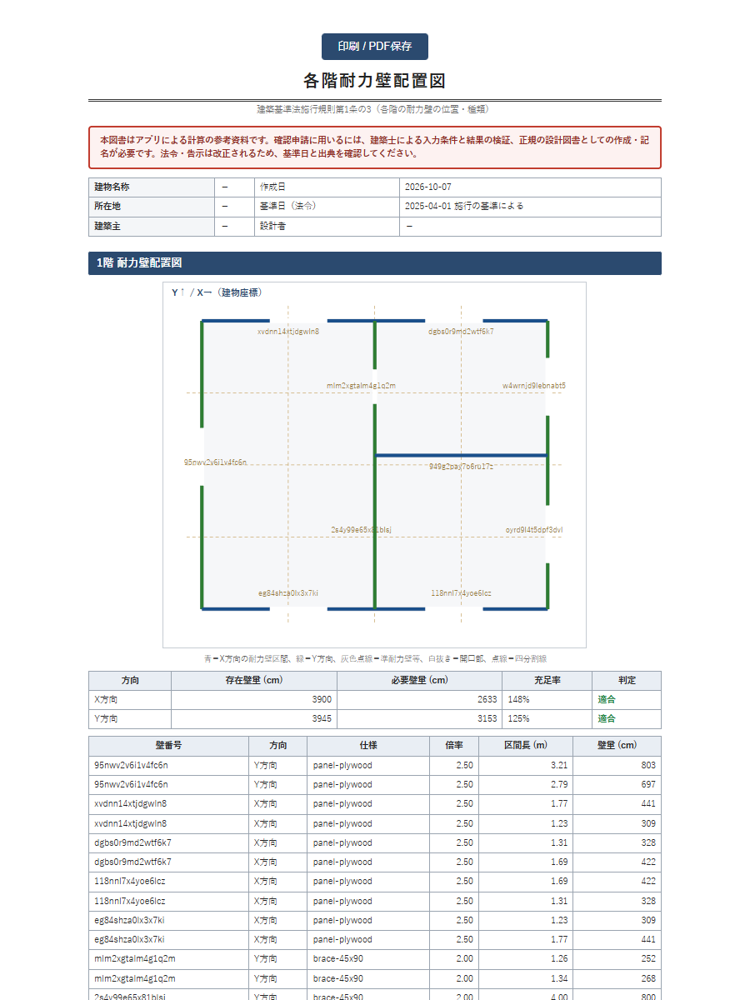

---

## 7. 四分割法

告示1100号第4。各方向について、床面積ポリゴンの直交軸の広がりを 4 等分し、両側端の 1/4 の帯でポリゴンを切り出して**側端部分の床面積**を求める（`clipBand`、吹抜けは控除）。存在壁量は帯に中点が入る耐力壁区間の合計。

`必要 = 側端床面積 × Lw（地震）`、充足率 = 存在/必要。判定は「両側端の充足率がともに ≥ 1」または「壁率比 = min/max ≥ 0.5」。準耐力壁等は四分割の存在壁量に算入しない。

**検算（本例の1階 Y 方向）**：帯 16.88㎡ × 39 = 658cm。左 1500 → 228%、右 1125 → 171%、壁率比 171/228 = **0.75** → 適合（D2 一致）。

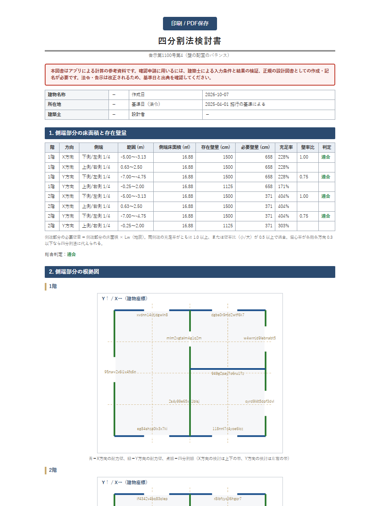

偏心率の略算（D1 の参考章）が各階各方向 0.3 以下なら四分割法に代えられる旨を注記するが、判定の総合には含めない。

---

## 8. N値計算

平成12年建設省告示第1460号第2号。

**式**：平屋・最上階 `N = A1·B1 − L`、2階建ての1階 `N = A1·B1 + A2·B2 − L`。B1・B2 は出隅 0.8／その他 0.5。L は 1階（2階建て）で出隅 1.0／その他 1.6、最上階で出隅 0.4／その他 0.6。

**実装**：
- 柱は、柱ノードがあればそれ、無ければ**耐力壁区間の両端点**（0.15m 以内は併合）。**壁の途中に立つ柱は生成しない**。
- A は柱に取り付く軸組の「右側の倍率和 − 左側の倍率和」の絶対値（筋かい補正を加えてから）。X・Y それぞれ求めて大きい方を採用。上階の柱は 0.3m 以内の最寄りを使う。
- **出隅**は床面積ポリゴンの凸頂点から 0.3m 以内。
- 金物区分：い N≦0／ろ ≦0.65／は ≦1.0／に ≦1.4／ほ ≦1.6／へ ≦1.8／と ≦2.8／ち ≦3.7／り ≦4.7／ぬ ≦5.6（15kN×2＝30kN）／5.6超は「告示仕様外・N×5.3kN を個別確認」。区分のしきい値と必要耐力は金物メーカー資料で照合済みと記録されている。
- Ho > 3.2m の階は「N値計算法が必須」の注記。

**検算（本例の1階の出隅）**：合板（2.5）の外壁が片側に取り付き、A1 = 2.5、上階も出隅で A2 = 2.5。`N = 2.5×0.8 + 2.5×0.8 − 1.0 = 3.00` → 「ち」引き寄せ金物 20kN（D3 一致）。

**確信度：中・要照合**：**筋かいの補正値（片筋かいの柱頭側 +、柱脚側 −）は、告示の表が画像で機械抽出できず、設計実務の一般的な表から転記した値**である（`n-value-tables.json` の `confidence: medium`）。3×9 と 4.5×9 は ±0.5、9×9 は ±2.0、たすき掛けは 0。筋かいの向きが未設定のときは安全側に両端へ + を使う。**筋かいを使う設計では、告示本文の表と必ず照合すること。**

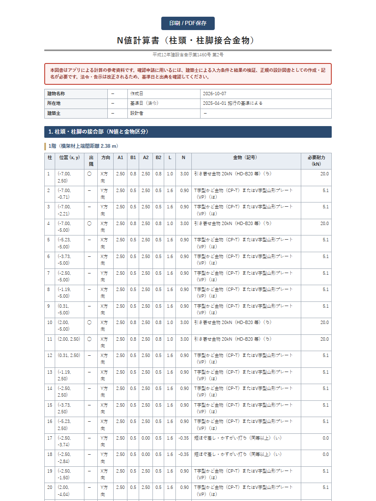

---

## 9. 柱の小径

令43条・告示1349号第1。公式表計算ツールと同式。

```
l = 階高×1000 − 120（2階建ての1階）／ − 105（それ以外）   [mm]
a = √( w·Ae / (Kd/3 · Fc) · 1000 )        Ae = 5.0 ㎡、Kd = 1.1
y = l/52.7   z = l/8.66
y > a : de = (12·l²·a²/3000)^(1/4)    z < a : de = a    それ以外 : de = l/75.05 + √((l/75.05)² + a²/1.3)
de = max(ceil(de), ceil(√12·l/150))       有効細長比 150 以下（令43条6項）
```

負担荷重 w は外周柱と内部柱（外壁分を内壁分に置換）で別に出す。**柱 1 本の負担面積 Ae = 5㎡は仮定**で、実際の負担面積ではない。

**検算（本例）**：1階 外周 93mm（1/25.5）・内部 87mm、2階 外周 74mm・内部 70mm（D4 一致。公式例では 2階 84mm・1階 105mm）。柱ノードが無いと実寸との比較はされない。隅柱は通し柱または同等補強（令43条5項）を注記。

**自分で検証すること**：実際の柱の負担面積、柱の位置（外周／内部）の選択、樹種・等級に応じた Fc。

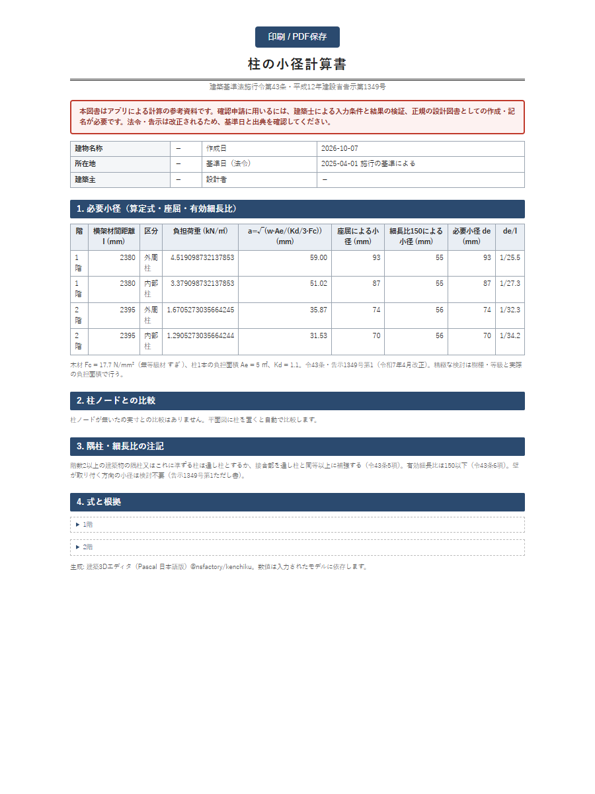

---

## 10. 参考章（偏心率・梁せい・基礎）

D1 の 7 章に**「参考」**として出し、判定の総合には**含めない**。

| 項目 | 方法 | 限界 |
|---|---|---|
| 偏心率（令82条の6） | 剛性を壁量に比例、重心を床面積の図心とみなす略算。Re ≦ 0.3 | 床の水平剛性・ねじれ剛性の精緻な評価ではない。四分割法の代替としての扱いは設計者が判断 |
| 梁せいの目安 | 部屋の短辺方向に梁を架けると仮定し、スパン表（梁幅 105・間隔 910・無等級材）で引く | プレカット・構造設計者の検定が必要 |
| 基礎の接地圧 | 概算重量（5〜5.5 kN/㎡）を布基礎・べた基礎の底面積で割り、地耐力（未入力は 30 kN/㎡を仮定）と比較。告示1347号の区分 | 実際の基礎設計は地盤調査（SWS 試験等）に基づく |

本例の結果は、布基礎の接地圧 45.45 kN/㎡（不可）、べた基礎 10.00 kN/㎡（可）。

---

## 11. 法規チェック 19 項目

各項目は `{ id, title, law, article, url, status, measured, limit, explain }`。status は 5 種類：

| status | 意味 |
|---|---|
| ok / ng | 基準を満たす／満たさない |
| warn（画面では「要確認」） | 判定はしたが人の確認が要る、または近似で判定した |
| input-needed（「入力待ち」） | **入力が無いので判定していない**。無理に判定しない設計 |
| n/a（「対象外」） | 当てはまらない |

| 区分 | 項目（条文）と主な近似・未考慮 |
|---|---|
| 集団 | 接道（法42・43条）、建蔽率（法53条：建築面積は各階床面積の最大＋近似。**1m 超の軒の出は未考慮**）、容積率（法52条：地階・車庫・小屋裏収納の不算入は未考慮）、絶対高さ（法55条）、外壁後退（法54条：物置等の緩和は未考慮）、道路斜線（法56条1項1号：**最高高さを全頂点に用いる安全側近似。幅員 12m 以上等の緩和は未考慮**）、北側斜線（同3号）、隣地斜線（同2号：高さ 20m 以下は対象外）、日影（法56条の2：**対象判定のみ**）、延焼のおそれのある部分の開口（法2条6号・61条：**対面建築物による緩和は未考慮**）、高度地区（法58条） |
| 単体 | 採光（法28条1項・令20条：Σ(窓面積×補正係数)≧床面積/7、補正係数 住居系 `d/h×6−1.4`・商業 `×10−1.0`・工業 `×8−1.0`、上限 3.0。**h は開口中心から軒までで近似。庇・張り出しは未考慮**）、換気（法28条2項：開放可能面積≧床面積/20。**`openableArea` 未入力は窓面積の 1/2 と仮定し要確認**）、天井高（令21条：2.1m）、階段（令23条：蹴上 23cm 以下・踏面 15cm 以上・幅 75cm 以上。階段ノードが無いと要確認）、床高（令22条：45cm・防湿措置で対象外）、火気使用室の内装制限（令128条の4） |
| その他 | 省エネ適合義務（2025-04〜。常に「仕様基準または計算が必要」を表示し代表値を出す。**計算はしない**）、確認申請の区分と手続き（新2号／新3号、審査 35日、提出先） |

**自動化していない／できない項目**：日影図・天空率、省エネ計算、構造以外の防火仕様（防火構造の認定の確認）、各種条例・景観・開発。

**本例の画面**：適合 7・不適合 0・要確認 8・入力待ち 15（敷地の入力が無いため）。「入力待ち」を埋めずに「適合」と読むのは誤りである。

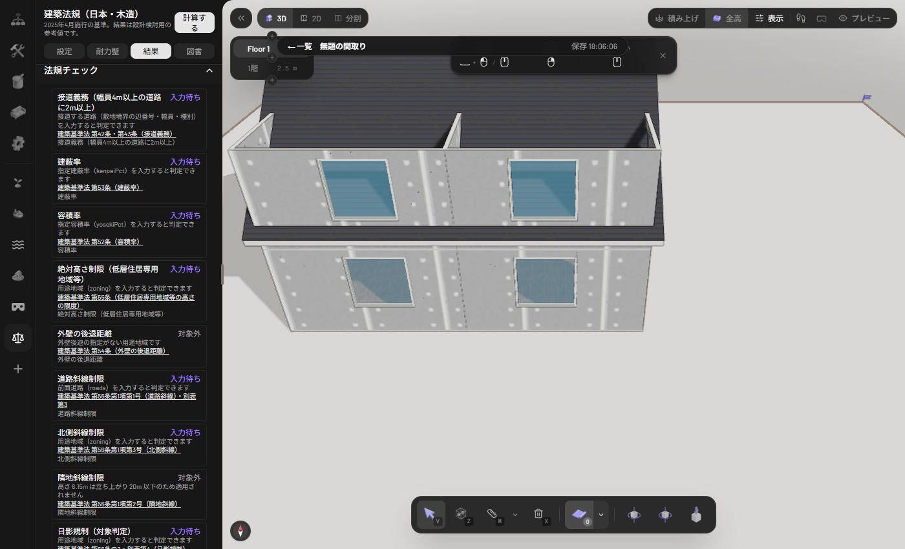

---

## 12. 図書 D1〜D9 と確認申請の図書（規則1条の3）

| 図書 | 中身 | 規則1条の3 等との対応 | 自分で足すもの |
|---|---|---|---|
| D1 壁量計算書 | 概要・荷重（式と代入値）・床面積表・見付面積表（内訳）・必要壁量・存在壁量（壁ごと）・判定・準耐力壁割合・等級参考・参考章 | 壁量計算書 | 壁の取付仕様の根拠 |
| D2 四分割法検討書 | 側端の床面積・存在壁量・充足率・壁率比・根拠図 | 四分割法の計算 | ― |
| D3 N値計算書 | 柱ごとの A1/A2/B/L/N・金物・必要耐力 | 柱頭柱脚金物 | 金物の製品選定 |
| D4 柱の小径計算書 | l・負担荷重・Fc・必要小径・de/l | 柱の小径の検討 | 実柱の割付 |
| D5 各階耐力壁配置図 | 平面に耐力壁区間を方向別に色分け・壁ごとの表 | 各階耐力壁図 | 図面様式への転記 |
| D6 面積表・求積図 | 各階床面積・延べ・建築面積（近似）・座標法の表 | 床面積求積図 | 建築面積の正式求積 |
| D7 建築法チェック結果 | §11 の全項目の表 | ― | ― |
| D8 提出図書チェックリストと手続き | 規則1条の3（木造2階建て）の図書一覧、本アプリで出せる／別途作る、申請の流れ | 一覧のみ | 付近見取図・配置図・立面・断面・伏図・軸組図・構造詳細図・省エネ関係図書 ほか |
| D9 仕様表 | 令37〜49条の記入欄と本アプリで分かる値の自動記入 | 仕様表（令37〜49条） | 基礎・土台緊結・火打・防腐防蟻等の記入 |

画面の「新しいタブで開く」→ブラウザの印刷で PDF。各図書の冒頭に免責と基準日が入る。日本語 PDF の自前生成はしない（HTML 印刷で代替）。

> **既知の不便**：D1・D2・D5 の「壁番号」は内部 ID（英数字）で出る。壁の長さ・方向・仕様から同定すること。D6 の座標は建物座標系で、敷地座標とは限らない。


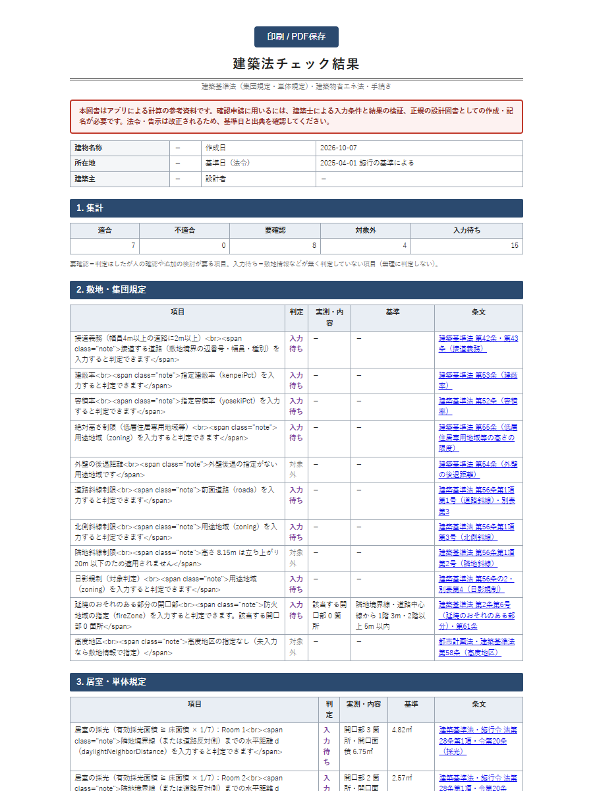

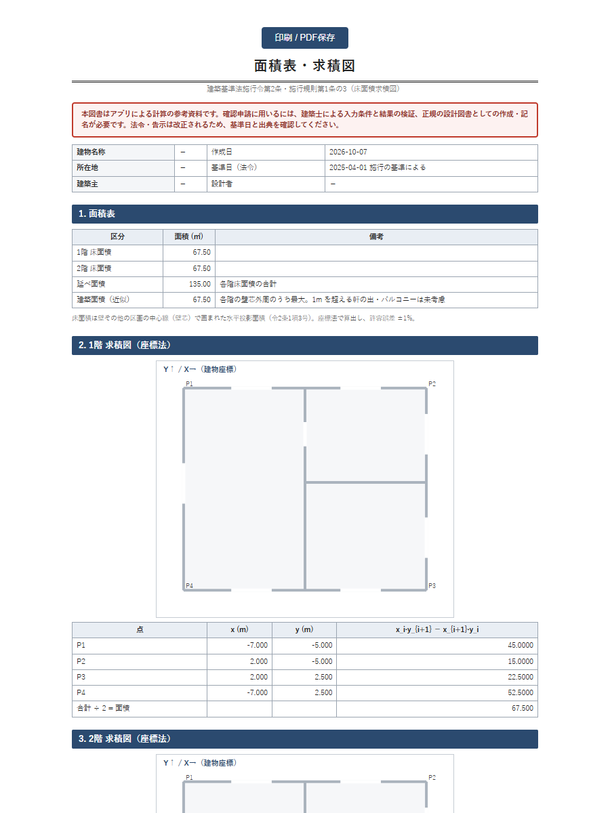

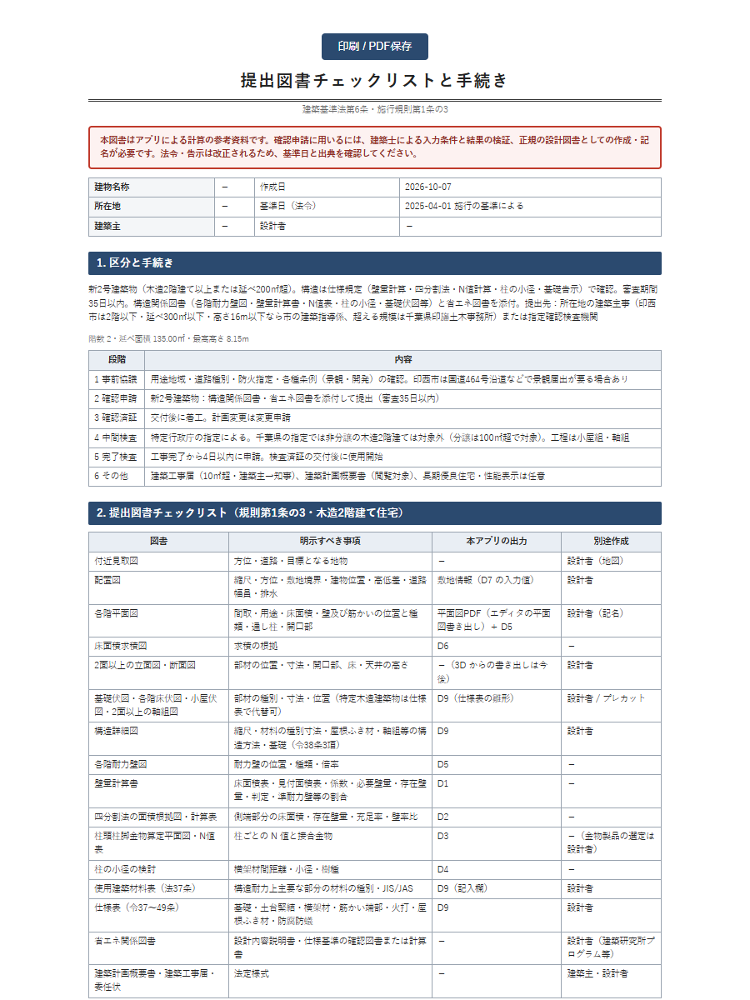

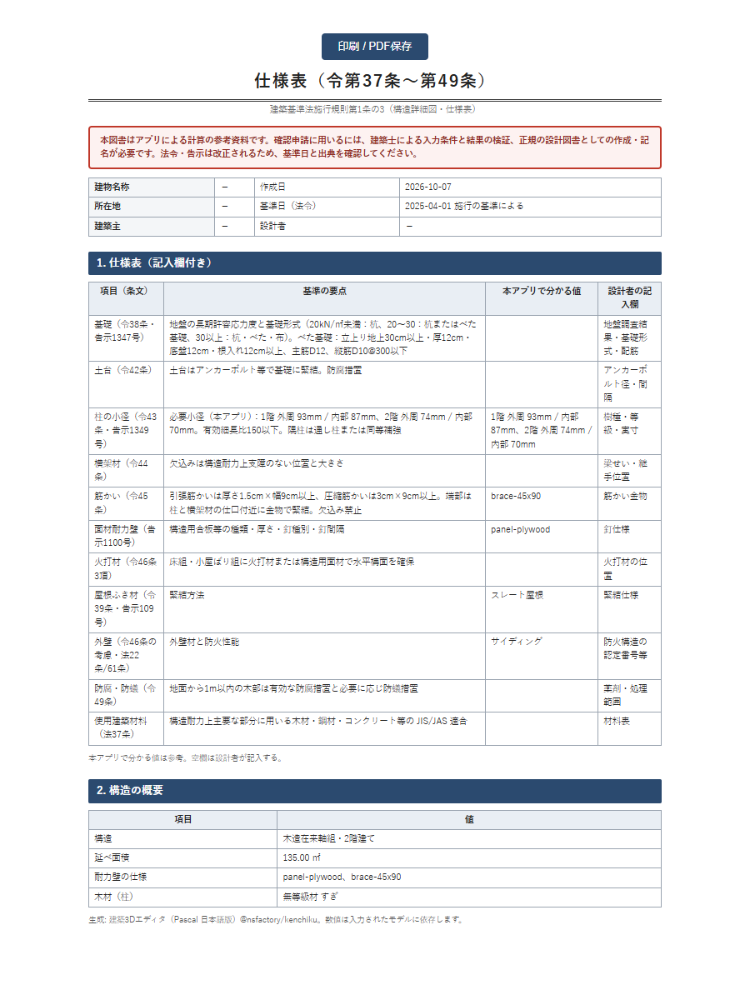

---

## 13. Claude Code / MCP から使う

エージェントから使うときの4ツール（契約：`packages/core/src/agent-tools/kenchiku.ts`、手順：`skills/pascal-3d/references/tool-workflows.md`）。**本稿では MCP 接続での実行は未検証**（契約とスキル文書の記述による）。

| ツール | 種別 | 入力 | 戻り |
|---|---|---|---|
| `jp_set_wall_bearing` | 書き込み | `wallIds[]`（必須）、`kinds[]`（`none`・`lath-one/both`・`brace-15x90/30x90/45x90/90x90`・各たすき掛け `-x`・`panel-plywood`・`panel-gypsum`・`panel-other`・`custom`）、`ratioOverride`（0〜7・custom/panel-other 用）、`faces`（one/both）、`clear` | 更新した壁。壁の `jp.bearing` だけが変わる |
| `jp_structural_check` | 読み取り | `buildingId?` | 必要壁量（`requiredWall.lw`、cm/㎡）、風、存在壁量（階・方向別の適否）、四分割、N値、柱の小径、すべて explain 付き |
| `jp_building_code_check` | 読み取り | `buildingId?` | §11 の結果一覧。入力が無い項目は input-needed |
| `jp_get_document` | 読み取り | `doc`（D1〜D9）、`buildingName?`・`address?`・`designer?`（表紙） | HTML 全文 |

手順の例：`get_walls` で壁 ID を得る → `jp_set_wall_bearing`（例：外壁に `panel-plywood`、間仕切に `brace-45x90`）→ `jp_structural_check` → `jp_building_code_check` → `jp_get_document`。壁の仕様が無い壁は非耐力壁として扱われる。拒否応答 `jp_not_computable` が欠けている入力を名指しする（建物が無い・階数が範囲外など）。敷地の用途地域などは**人が画面で入力する**もので、エージェントが作り出してはならない。

---

## 14. 既知の制約・未確認事項・今後

**未確認事項（要照合）**

| 項目 | 状況 | 確信度 |
|---|---|---|
| N値の筋かい補正値 | 実務の一般表からの転記。告示本文の表と未照合 | **中** |
| 風の係数・令88条2項区域（C0=0.3） | 特定行政庁の指定。入力項目。既定は 50／0.2 | ― |
| 公式 Excel との突き合わせ | 仕様書に照合済みの記録。本稿では再実施していない | 高（記録上）／本稿では未検証 |
| 屋根なしの仮定・MCP 実行 | 実装記録・契約による。本稿では実行していない | 中 |

**実装上の制約**

- 耐力壁の仕様は「耐力壁」タブで設定。壁インスペクタへの欄追加は未実装。準耐力壁等の壁ごとの指定入力が無い。
- 柱は耐力壁区間の両端点から生成し、壁の途中の柱は作らない（N値の対象外になる）。
- 平面図の耐力壁の色分け（青＝X・緑＝Y・灰の破線＝準耐力壁等）は、「計算する」の後に表示中の階の壁の上に重ねて描く（以前は壁・部屋の描画より下に隠れていたが、描画順を壁の上に移して解消）。計算後にモデルを変えると結果が古くなり、色は薄くなる。3D 側の耐力壁の表示は未実装。
- 画面の一部が英語（階名「Floor 1」、屋根の形、「Zone」）。部屋名が画面では「部屋 1」、法規チェックでは「Room 1」と出る。
- 日影図・天空率・省エネ計算・GIS 取り込み（用途地域の自動取得）は未実装。

**今後（仕様書 §14）**：フェーズB＝木造3階建て・300㎡超（許容応力度計算。外部の構造計算ソフトとの連携を先行）、フェーズC＝鉄骨・RC（構造種別の切替と図書リストから）。

---

## 付録 出典

- 国交省 技術的助言 国住指第425号（2025）：https://www.mlit.go.jp/common/001877517.pdf
- 令和7年国土交通省告示第215号：https://www.mlit.go.jp/jutakukentiku/build/content/001879919.pdf
- 壁量基準の見直し（補足資料 R6.7.8）：https://www.mlit.go.jp/jutakukentiku/build/content/001753667.pdf
- HOWTEC 設計支援ツール（表計算ツール・早見表）：https://www.howtec.or.jp/publics/index/411/
- 建築基準法施行令（e-Gov）：https://laws.e-gov.go.jp/law/325CO0000000338 （令46条は `#Mp-At_46`）
- 建築基準法施行規則（規則1条の3）：https://laws.e-gov.go.jp/law/325M50004000040
- 平成12年建設省告示第1460号：https://www.mlit.go.jp/jutakukentiku/build/s20000523/n026.pdf／第1352号：https://www.mlit.go.jp/notice/noticedata/pdf/201703/00006444.pdf／第1347号：https://www.mlit.go.jp/notice/noticedata/pdf/201703/00006441.pdf
- 2025年4月改正の公式ハブ：https://www.mlit.go.jp/jutakukentiku/build/r4kaisei_shoenehou_kijunhou.html
- 印西市（限定特定行政庁・確認申請）：https://www.city.inzai.lg.jp/0000000193.html

## 免責（再掲）

結果は設計検討用の参考値。確認申請には建築士による検証と正規の設計図書としての作成・記名が必要。法令は改正される（基準日 2025-04-01）。
